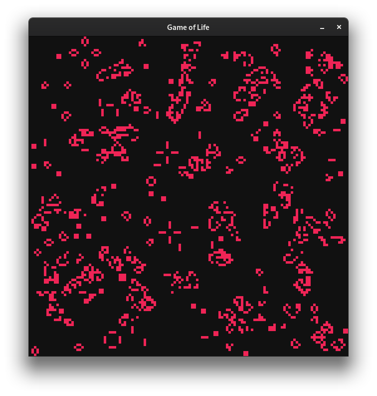

# Game of Life [](https://travis-ci.com/hexvalid/game-of-life)  [](https://www.gnu.org/licenses/gpl-3.0)
                                                                                                                                              


[Conway's Game of Life](http://en.wikipedia.org/wiki/Conway%27s_Game_of_Life)  with with Test Driven Methodology implementation in Go + SDL


## Getting Source

```
go get -v github.com/hexvalid/game-of-life
```

## Installing and Running
```
go install -v github.com/hexvalid/game-of-life
$GOPATH/bin/game-of-life
```
**NOTE:** `go install` commands  just compile the executable file and move it to `$GOPATH/bin` destination.

Also pre-built binaries can download from the [releases](https://github.com/hexvalid/game-of-life/releases) page. 

## Testing
```
go test -v github.com/hexvalid/game-of-life
```

Example output of tests:
```
=== RUN   TestGamePrint
=== RUN   TestGamePrint/Print_Game_Table_to_Console
1 0 0 
0 1 0 
0 0 1 

--- PASS: TestGamePrint (0.00s)
    --- PASS: TestGamePrint/Print_Game_Table_to_Console (0.00s)
=== RUN   TestGameTableEquality
--- PASS: TestGameTableEquality (0.00s)
=== RUN   TestGameRules
--- PASS: TestGameRules (0.00s)
=== RUN   TestGameRandomize
--- PASS: TestGameRandomize (0.03s)
=== RUN   TestSDL
--- PASS: TestSDL (0.17s)
PASS
ok  	github.com/hexvalid/game-of-life
```

_Tested with Go v1.13.5 and SDL2 v2.0.10 on Gentoo Linux (kernel-5.5.2-r1)_

## Screenshot


## License
GNU General Public License v3.0 - see [LICENSE](LICENSE) file.